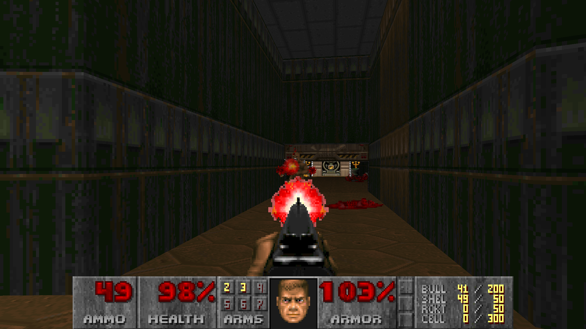

# glDoom Resurrected (again!)
This repository contains improvements for the glDoom port by Bruce Lewis



### Fixes (original from REDPOWAR)
* new floor/ceiling generation code (similar to code from Doom Legacy port)
* aspect ratio fix (correct rendering on 16:9 displays)
* fixed invisible area culling (behind walls in sectors without ceiling)
* few bugfixes for buffer overflows & invalid memory pointers

### Fixes from Gibbon
* 64bit cleanups to allow it to build and run on 64bit systems
* Cleanups for modern types (uintptr_t, intptr_t and MSVC specific functions like (underscore)access etc..)
* FMOD Studio support and crash fixes

### Fixes from Losilof39
* Cleaned up all Win32 code and added a SDL2 backend
* Ported to Linux but it's not stable yet
* Mouse support
* Audio is rewritten using SDL2 and taken from chocolate doom
* Now the melting screen works!

### Fixes from Wolf3s
* Added a wrapper for encapsulate underscore newlib functions
* Removal of unused declarations
* Code cleanup
* Remove type defintions 
* Add ANSI C Implementation in some parts.

### Current Problems
* Clipping issue due to changing fov
* Fullscreen option not working
* Resolution option not working

### TO-DO List
1. Increasing the vanilla limits and adding support for No Rest For The Living and SIGIL

Plus more!

## Compiling

### Windows
Use the Visual Studio project and build for your architecture.
Now it compiles on x64.

### Linux
Run ``` sh build.sh ``` in the commandline to build.

### Game data
Before playing DOOM, you will need to also create the gldoom.wad file by using the wadbuild tool (wadbuild.exe gldoom.lst) in the resources directory.
Be sure that gldoom.wad and your IWAD of choice (DOOM, DOOM 2, Ultimate Doom, ...) are in the same folder as the executable!
In order to hear the music in-game you should download [this](https://archive.org/download/free-soundfonts-sf2-2019-04/SC-55.sf2) soundfont, rename it to "soundfont.sf2" and place it in the game directory. You could use other sf2 files but I would recommend to use the SC-55, which is the soundcard originally used to create the DOOM music.

### Why maintain glDoom?
The answer is simple. These older source ports are special, they paved the way for what we have now, an actual piece of Doom history. While glDoom will never be as popular as GZDoom or PRBoom, it's history and legacy is an important part of the Doom Community and rather than be forgotten, they should be maintained for the next generation to use. Also for me (Losilof39) is a great way to learn how a large project like Doom is organized, coded and I'm honored to maintain this great work of art alive and bring new features to it!
